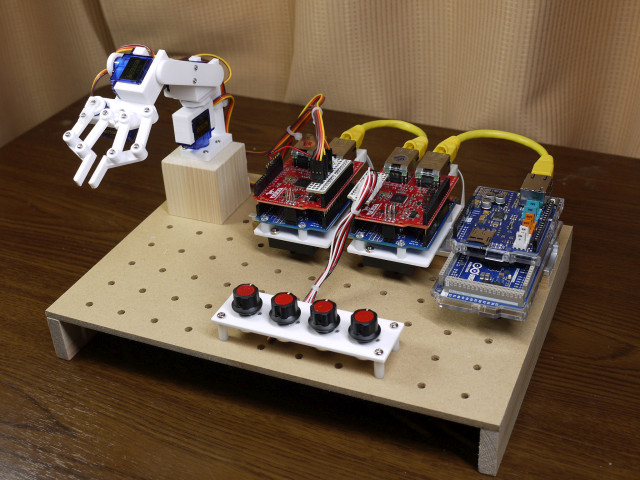
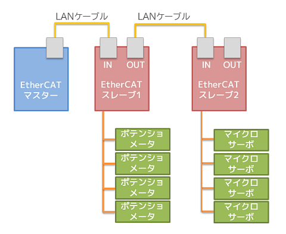
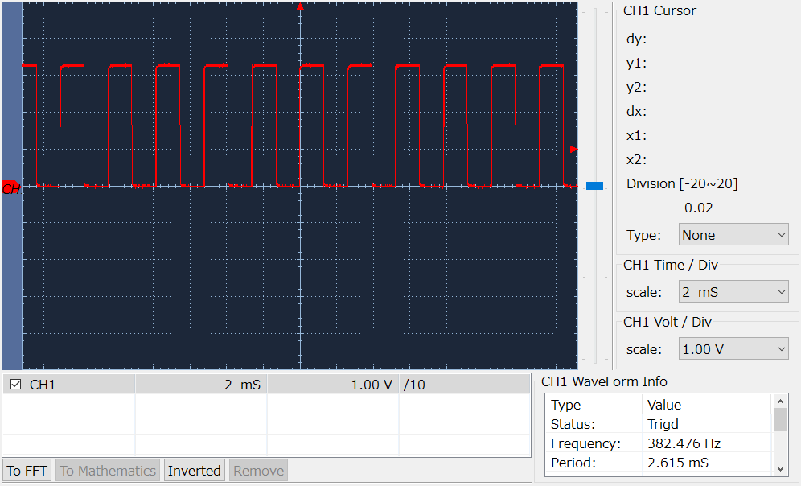

# ArduinoでEtherCATのデモ

マスターもスレーブもArduonoで作ったEtherCATネットワークのデモ。

4つのノブで4軸のアームロボットをコントロールする。

## 全体図

## マスター
- ハードウェア: Arduino Due + Ethernet Shield 2
- 依存ライブラリ: [SOEM4Arduino](https://github.com/lipoyang/SOEM4Arduino)
- スケッチ: [ec_master/ec_master.ino](ec_master/ec_master.ino)

スレーブ1から4個のポテンショメータの値を取得し、スレーブ2へ4個のマイクロサーボの指令値を設定する。

## スレーブ1
- ハードウェア: Arduino Uno + EasyCAT Shield
- 依存ライブラリ: [EasyCAT Library V2.0](https://www.bausano.net/en/hardware/ethercat-e-arduino/easycat.html)
- スケッチ: [ec_slave1/ec_slave1.ino](ec_slave1/ec_slave1.ino)
- 入力デバイス: ポテンショメータ(可変抵抗 B型 10kΩ) × 4個

ノブを取り付けた4個のポテンショメータで0～5Vのアナログ信号を4つ作り、Arduino UnoのA0～A3に入力する。それらがスレーブ2のアームロボットの肩、肘、手首、指の関節の指令値となる。

## スレーブ2
- ハードウェア: Arduino Uno + EasyCAT Shield
- 依存ライブラリ: [EasyCAT Library V2.0](https://www.bausano.net/en/hardware/ethercat-e-arduino/easycat.html)
- スケッチ: [ec_slave2/ec_slave2.ino](ec_slave2/ec_slave2.ino)
- 出力デバイス: マイクロサーボSG90 × 4個

4個のマイクロサーボSG90をArduino Dueの3,4,5,6番ピンに接続する。サーボの電源はArduinoの5Vからは取らず別途供給すること。マイクロサーボはアームロボットに組付けて、肩、肘、手首、指の関節を駆動する。アームロボットは下記のキットを用いた。
- [SG90･SG92R用ロボットアームキット2](https://www.amazon.co.jp/dp/B07ZCV7NTC/)  

※このキットではいちばんトルクを要する肘関節にはSG92Rを用いるように書かれているが、SG92を用いると著しい振動が見られたのですべての関節にSG90を用いた。(ロットによるかもしれない。)

## 動画

## 所感
オーバースペックにもほどがある制御系である。

EtherCATの通信周期は実測で約1.3msecであった。本気のEthernetはこんなものではないはずだが、ジッタは数usec以下に抑えられている。そもそもマイクロサーボの制御パルスは20msec周期であるから、通信周期1.3msecでも速すぎて宝の持ち腐れである。

## 参考
- [ArduinoやラズパイでEtherCAT - 滴了庵日録](https://lipoyang.hatenablog.com/entry/2019/08/13/125008)
